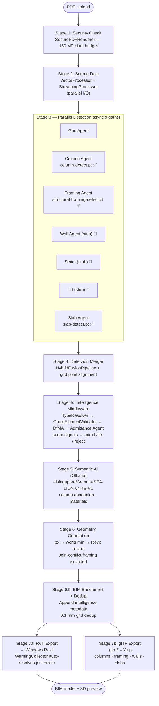
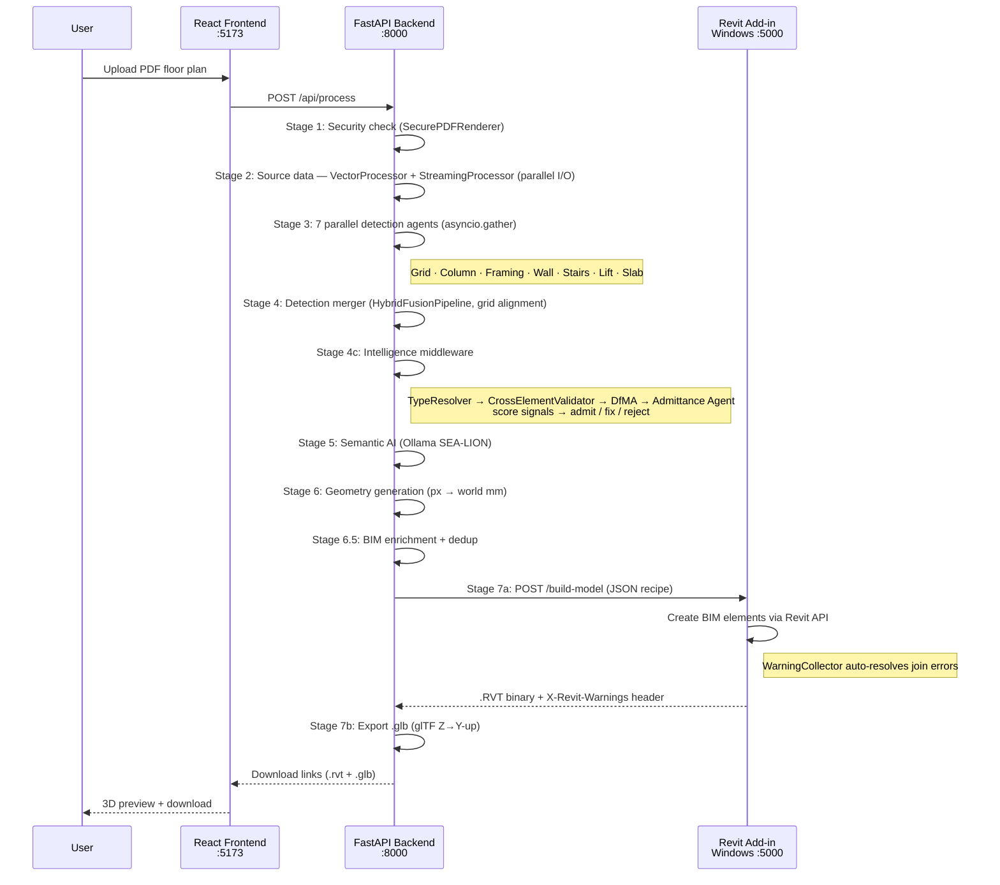

# Deployment Guide

Complete setup instructions for the MCC Amplify v4 system.

---

## Overview

The system requires **two machines on the same network**:

| Machine | Role | Key Process |
|---------|------|-------------|
| Ubuntu (Linux) | Main processing, web UI, AI pipeline | `./run.sh` |
| Windows (10/11 Pro) | Revit BIM builder | Build + launch Revit Add-in |

The Ubuntu machine does all the heavy lifting (PDF processing, AI analysis, intelligence middleware, geometry generation). The Windows machine runs Revit and the C# Add-in that converts the generated instructions into a native `.RVT` file.

> **Startup order matters:** Start the Windows Revit Add-in **first**, then start the Ubuntu system.

---

## System Architecture

```mermaid
flowchart LR
    subgraph UBUNTU["Ubuntu (Linux)"]
        direction TB
        FE["React + Three.js\nFrontend :5173"]
        API["FastAPI Backend :8000"]
        SEC["SecurePDFRenderer\n150 MP pixel budget"]
        SRC["Source Data (parallel)\nVectorProcessor + StreamingProcessor"]
        AGENTS["7 Parallel Detection Agents\nGrid · Column · Framing · Stairs · Lift · Wall · Slab"]
        MERGE["Detection Merger\nHybridFusionPipeline + grid pixel alignment"]
        INT["Intelligence Middleware\nTypeResolver → CrossElementValidator → DfMA → Admittance Agent\nscore signals → admit / fix / reject"]
        SEM["Semantic AI (Ollama)\naisingapore/Gemma-SEA-LION-v4-4B-VL"]
        GEO["Geometry Generator\n_px_to_world → _snap_to_nearest_grid"]
        BTE["BIM Enricher + Dedup\n(0.1 mm grid rounding)"]
        RVTEXP["RVT Exporter (RevitClient)"]
        GLTEXP["glTF Exporter"]
        CHAT["Chat Agent (Ollama)\nqwen3-vl:2b / gemma3:4b-it-qat"]

        FE --> API
        API --> SEC --> SRC --> AGENTS --> MERGE --> INT --> SEM --> GEO --> BTE
        BTE --> RVTEXP
        BTE --> GLTEXP
        API -.-> CHAT
    end

    subgraph WIN["Windows"]
        REVIT["Revit 2023\nC# Add-in (TcpListener :5000)\nWarningCollector auto-resolves join errors"]
    end

    RVTEXP -->|"JSON recipe\nHTTP POST /build-model"| REVIT
    REVIT -->|".rvt binary + X-Revit-Warnings"| RVTEXP
```



Both machines must be on the same local network (or VPN). The Ubuntu machine is the primary — it hosts the web UI, runs all AI processing, and drives the Windows Revit machine.

---

## Pipeline Flow



---

## Prerequisites Checklist

### Ubuntu Machine
- [ ] Ubuntu 20.04 LTS or 22.04 LTS
- [ ] 16 GB RAM minimum (32 GB recommended)
- [ ] 50 GB free disk space
- [ ] `sudo` access
- [ ] Internet connection (for API calls and package installation)

### Windows Machine
- [ ] Windows 10/11 Pro or Windows Server 2019+
- [ ] Revit 2023 installed with a valid license
- [ ] .NET SDK 8.0 installed (<https://dotnet.microsoft.com/download>)
- [ ] .NET Framework 4.8 runtime installed
- [ ] Administrator rights

### Ollama Models (required — no API keys needed)

Install Ollama on Ubuntu: <https://ollama.com/download>

```bash
ollama pull qwen3-vl:2b                                  # chat agent (default)
ollama pull gemma3:4b-it-qat                             # chat agent (alt)
ollama pull aisingapore/Gemma-SEA-LION-v4-4B-VL:latest  # semantic analysis
```

---

## Part 1: Ubuntu Setup

### 1.1 Install System Dependencies

```bash
sudo apt update && sudo apt upgrade -y

sudo apt install -y \
    build-essential git curl wget nano \
    libgl1-mesa-dev libglib2.0-0 libsm6 libxext6 libxrender1 libgomp1 \
    tesseract-ocr tesseract-ocr-eng \
    poppler-utils ghostscript

# Node.js 20 LTS
curl -fsSL https://deb.nodesource.com/setup_20.x | sudo bash -
sudo apt install -y nodejs

# Verify
node --version    # v20.x.x
npm --version     # 10.x.x
tesseract --version
```

### 1.2 Clone the Repository

```bash
cd ~
git clone https://github.com/josephteh97/mcc-amplify-ai.git
cd mcc-amplify-ai
```

### 1.3 Create Python Environment

Using **conda** (recommended):

```bash
conda create -n amplify-ai python=3.10 -y
conda activate amplify-ai
```

Or using **venv**:

```bash
python3 -m venv backend/venv
source backend/venv/bin/activate
```

### 1.4 Install Backend Dependencies

```bash
cd ~/mcc-amplify-ai/backend
pip install -r requirements.txt
```

Verify critical packages:

```bash
python -c "import fastapi, loguru, fitz, ultralytics, trimesh; print('All OK')"
```

### 1.5 Install Frontend Dependencies

```bash
cd ~/mcc-amplify-ai/frontend
npm install
```

### 1.6 Configure Environment

```bash
cd ~/mcc-amplify-ai/backend
cp .env.example .env   # if .env.example exists, otherwise edit .env directly
nano .env
```

**Required settings:**

```bash
# -- Chat Agent (local Ollama — no API key) ------------------------------------
#   qwen3_vl  → qwen3-vl:2b        (default)
#   gemma3_it → gemma3:4b-it-qat   (alternative)
CHAT_MODEL_BACKEND=qwen3_vl

# -- Semantic AI Backend (local Ollama) ----------------------------------------
SEMANTIC_BACKEND_PRIORITY=ollama
SEMANTIC_MODEL_BACKEND=ollama
OLLAMA_URL=http://localhost:11434
OLLAMA_MODEL=aisingapore/Gemma-SEA-LION-v4-4B-VL:latest

# -- Intelligence Middleware (Stage 4c) ----------------------------------------
COLUMN_CONF_THRESHOLD=0.25      # YOLO confidence for column detection
MAX_GRID_DIST_PX=80             # Max px distance from grid → "off_grid" flag
ISOLATION_RADIUS_PX=200         # Neighbourhood consensus radius
MIN_BAY_MM=3000                 # DfMA minimum bay spacing (SS CP 65)
MAX_BAY_MM=12000                # DfMA maximum bay spacing (SS CP 65)

# -- Beam geometry defaults ----------------------------------------------------
DEFAULT_BEAM_DEPTH_MM=800       # Beam cross-section depth (matches column default)

# -- Windows Revit Server ------------------------------------------------------
# The C# Add-in listens on TCP port 5000 (TcpListener — works cross-machine)
WINDOWS_REVIT_SERVER=http://LT-HQ-277:5000
REVIT_SERVER_API_KEY=choose_a_shared_secret

# -- FastAPI -------------------------------------------------------------------
APP_HOST=0.0.0.0
APP_PORT=8000
DEBUG=false

# -- Upload Limits -------------------------------------------------------------
MAX_UPLOAD_SIZE=52428800    # 50 MB
ALLOWED_EXTENSIONS=pdf
```

### 1.7 Create Data Directories

```bash
cd ~/mcc-amplify-ai
mkdir -p data/uploads data/processed \
         data/models/rvt data/models/gltf data/models/render \
         logs
chmod -R 755 data/ logs/
```

### 1.8 YOLO Weights

Place the trained YOLO weights at:

```
backend/ml/weights/column-detect.pt              ← structural column detection
backend/ml/weights/structural-framing-detect.pt  ← beam / structural framing detection
backend/ml/weights/slab-detect.pt                ← slab detection
```

All three files must be present for full detection. The pipeline continues if any is missing (vector-only or partial-agent fallback), but detection quality will be reduced.

### 1.9 Register Windows Hostname (first-time only)

Find the Windows IP address (`ipconfig` on Windows), then on Ubuntu:

```bash
echo "191.168.124.64 LT-HQ-277" | sudo tee -a /etc/hosts
# Replace with your actual Windows IP and hostname
```

---

## Part 2: Windows (Revit Add-in) Setup

The system uses a **C# Revit 2023 Add-in** at `revit_server/RevitAddin/`. It loads directly into Revit on startup, exposes a TCP socket on port 5000, and creates BIM elements natively via the Revit API.

> **Why TCP and not HTTP?** Windows HTTP.sys (`HttpListener`) only binds to `127.0.0.1` even when configured for `+`. `TcpListener(IPAddress.Any, 5000)` binds to `0.0.0.0:5000` and is reachable from the Ubuntu machine on the same network.

### 2.1 Build the Add-in

Open **PowerShell as Administrator** on the Windows machine:

```powershell
cd C:\path\to\mcc-amplify-ai\revit_server\RevitAddin
dotnet clean
dotnet build
```

A successful build produces:
- `bin\Debug\net48\RevitModelBuilderAddin.dll`

### 2.2 Deploy to Revit

Copy both files to the Revit add-ins folder:

```powershell
$addinsDir = "C:\ProgramData\Autodesk\Revit\Addins\2023"
New-Item -ItemType Directory -Force -Path $addinsDir | Out-Null
Copy-Item "RevitModelBuilder.addin" -Destination $addinsDir -Force
Copy-Item "bin\Debug\net48\RevitModelBuilderAddin.dll" -Destination $addinsDir -Force
```

### 2.3 Add Windows Firewall Rule (once)

```powershell
netsh advfirewall firewall add rule `
    name="RevitAddin5000" `
    dir=in action=allow protocol=TCP localport=5000 profile=any
```

### 2.4 Launch Revit

```powershell
Start-Process "C:\Program Files\Autodesk\Revit 2023\Revit.exe"
```

**When Revit opens:**
- Click **"Always Load"** on the security dialog — this allows the Add-in to load.
- Open or create a project file. The Add-in requires an active document to process requests.

The Add-in starts a `TcpListener` on port 5000 automatically. Check `C:\RevitOutput\addin_startup.log` to confirm it started correctly.

### 2.5 Verify the Service is Running

From Ubuntu, check connectivity:

```bash
curl http://LT-HQ-277:5000/health
# Expected: Revit Model Builder ready
```

#### 2.6 DLL update if C# code is Updated
```powershell
cd C:\MyDocuments\mcc-amplify-v4\revit_server\RevitAddin
dotnet build -c Release
Copy-Item bin\Release\net48\RevitModelBuilderAddin.dll, RevitModelBuilder.addin `
    -Destination "$env:ProgramData\Autodesk\Revit\Addins\2023\" -Force
```

---

## Part 3: Start the Full System

Once Windows is ready, start everything on Ubuntu:

```bash
cd ~/mcc-amplify-ai
./run.sh
```

Output:
```
  +======================================+
  |       Amplify AI System              |
  |   Floor Plan -> 3D BIM (RVT + glTF) |
  +======================================+

  Starting backend  ->  http://localhost:8000
  Waiting for backend to be ready...
  Starting frontend ->  http://localhost:5173

  Amplify AI is running
    Frontend:  http://localhost:5173
    Backend:   http://localhost:8000
    API docs:  http://localhost:8000/api/docs
    Press Ctrl+C to stop both services.
```

Open `http://localhost:5173` in a browser.

---

## Part 4: Full End-to-End Workflow



---

## Part 5: Intelligence Middleware Configuration

The intelligence layer (Stage 4c) runs after grid detection and before semantic AI. It validates and classifies YOLO column detections without modifying their coordinates.

### Components

| Module | Purpose | Key output fields |
|--------|---------|-------------------|
| `type_resolver.py` | CV2 contour analysis on detection crops | `resolved_type` (circular/rectangular/L-shape), `type_confidence` |
| `cross_element_validator.py` | Pairwise IoU overlap, grid distance, isolation checks | `validation_flags`, `is_valid` |
| `validation_agent.py` | DfMA rule enforcement (SS CP 65), orphan detection | `dfma_violations`, `is_dfma_compliant`, `is_orphan` |
| `bim_translator_enricher.py` | Appends metadata to Revit recipe (post-geometry) | Intelligence fields copied to recipe columns |

### Environment variables

| Variable | Default | Description |
|----------|---------|-------------|
| `COLUMN_CONF_THRESHOLD` | `0.25` | YOLO confidence threshold for column detection |
| `MAX_GRID_DIST_PX` | `80` | Max pixel distance from nearest grid line before "off_grid" flag |
| `ISOLATION_RADIUS_PX` | `200` | Radius in pixels for neighbourhood consensus check |
| `MIN_BAY_MM` | `3000` | DfMA minimum bay spacing in mm (SS CP 65) |
| `MAX_BAY_MM` | `12000` | DfMA maximum bay spacing in mm (SS CP 65) |

### Safety constraint

The intelligence middleware **never modifies** coordinate values (`center`, `bbox`, `x`, `y`, `z`). The column placement pipeline (YOLO bbox -> `_px_to_world()` -> `_snap_to_nearest_grid()` -> `{x,y,z}`) is a frozen subsystem.

---

## Part 6: Production Hardening (Optional)

### Run Backend as a systemd Service

```bash
sudo nano /etc/systemd/system/amplify-ai.service
```

```ini
[Unit]
Description=Amplify AI Backend
After=network.target

[Service]
Type=simple
User=YOUR_USER
WorkingDirectory=/home/YOUR_USER/mcc-amplify-ai/backend
Environment="PATH=/home/YOUR_USER/miniconda3/envs/amplify-ai/bin"
ExecStart=/home/YOUR_USER/miniconda3/envs/amplify-ai/bin/python app.py
Restart=on-failure
RestartSec=5

[Install]
WantedBy=multi-user.target
```

```bash
sudo systemctl daemon-reload
sudo systemctl enable amplify-ai
sudo systemctl start amplify-ai
sudo systemctl status amplify-ai
```

### Nginx Reverse Proxy (Optional)

```bash
sudo apt install -y nginx
sudo nano /etc/nginx/sites-available/amplify-ai
```

```nginx
server {
    listen 80;
    server_name localhost;
    client_max_body_size 50M;

    location / {
        root /home/YOUR_USER/mcc-amplify-ai/frontend/dist;
        try_files $uri $uri/ /index.html;
    }

    location /api {
        proxy_pass http://localhost:8000;
        proxy_http_version 1.1;
        proxy_set_header Host $host;
        proxy_set_header X-Real-IP $remote_addr;
    }

    location /ws {
        proxy_pass http://localhost:8000;
        proxy_http_version 1.1;
        proxy_set_header Upgrade $http_upgrade;
        proxy_set_header Connection "upgrade";
    }
}
```

```bash
sudo ln -s /etc/nginx/sites-available/amplify-ai /etc/nginx/sites-enabled/
sudo nginx -t && sudo systemctl restart nginx
```

Build the frontend for production:

```bash
cd ~/mcc-amplify-ai/frontend && npm run build
```

---

## Part 7: Troubleshooting

### Ubuntu cannot reach Windows (`curl` times out)

```bash
# Test basic network
ping LT-HQ-277

# Test port specifically
nc -zv LT-HQ-277 5000

# If ping works but port fails -> Windows Firewall is blocking
# Add the firewall rule (see Part 2.3)
```

On Windows, confirm the Add-in is listening:
```powershell
netstat -ano | findstr :5000
# Should show: TCP  0.0.0.0:5000  0.0.0.0:0  LISTENING
```

### Grid detection produces wrong scale / falls back to uniform grid

The system derives real-world scale exclusively from structural column grid lines and their dimension annotations (numbers printed between grid lines, e.g. "6000"). Scale text like "1:100" in the title block is intentionally ignored.

If the grid is not detected:
- The fallback is a uniform 5x4 grid at 6000 mm bays.
- Check the backend log for `Grid detected:` or `Grid detection failed` at Stage 4.
- Floor plans without a visible structural grid (e.g. residential with no column annotations) will always fall back.

### Backend import error on startup

```bash
conda activate amplify-ai
python -c "from backend.services.core.orchestrator import PipelineOrchestrator; print('OK')"
```

### Revit Add-in not loading

- Verify both files exist in `C:\ProgramData\Autodesk\Revit\Addins\2023\`:
  - `RevitModelBuilder.addin`
  - `RevitModelBuilderAddin.dll`
- Check `C:\RevitOutput\addin_startup.log` — it is written by the Add-in on every Revit startup.
- Open Revit -> Add-ins tab -> confirm the Add-in appears.
- Run Revit as Administrator if there are permission errors.

### Revit is in a modal state

Dialogs (Print, Options, Save As) block the Revit API. Close all dialogs and ensure the main Revit window is in focus before triggering a pipeline run.

### YOLO weights not found

Place the trained weights at `backend/ml/weights/column-detect.pt`. The pipeline continues without YOLO (vector-only fallback), but detection quality will be reduced.

### Old data cleanup

```bash
# Remove uploads older than 7 days
find ~/mcc-amplify-ai/data/uploads/ -type f -mtime +7 -delete
find ~/mcc-amplify-ai/data/models/ -type f -mtime +7 -delete
```

---

## Revit Add-in Architecture (reference)

```
App : IExternalApplication
  +-- OnStartup()
       |-- Creates BuildHandler + ExternalEvent
       +-- Starts TcpListener(IPAddress.Any, 5000) in background thread

ListenLoop (background Task)
  +-- AcceptTcpClientAsync() -> HandleClient()
       |-- GET  /health        -> "Revit Model Builder ready"
       +-- POST /build-model   -> HandleBuildModel()
            |-- Deserialise JSON transaction (RevitTransaction schema)
            |-- BuildHandler.Prepare(json, outputPath)
            |-- ExternalEvent.Raise() -> marshals to Revit main thread
            |-- Waits up to 120 s for ManualResetEventSlim
            +-- Returns .rvt binary as HTTP response

ModelBuilder (runs on Revit main thread via ExternalEvent)
  +-- FindTemplate() -> prefers Default_M_*.rte (metric mm)
  +-- Creates: Levels -> Grids -> Columns -> Structural Framing (beams) -> Walls -> Slabs
  +-- WarningCollector (IFailuresPreprocessor) auto-resolves "Cannot keep elements joined"
      via HasResolutionOfType + SetCurrentResolutionType + ResolveFailure
```

---

## Project Structure (key files)

```
mcc-amplify-v4/
|-- run.sh                              <- Start Ubuntu backend + frontend
|-- backend/
|   |-- app.py                          <- FastAPI entry point
|   |-- .env                            <- Configuration (not committed)
|   |-- pipeline/
|   |   +-- pipeline.py                 <- Thin wrapper around PipelineOrchestrator
|   |-- services/
|   |   |-- core/orchestrator.py        <- Main pipeline orchestrator (all stages)
|   |   |-- intelligence/               <- Post-detection middleware layer
|   |   |   |-- type_resolver.py        <- Circular/rectangular/L-shape classification
|   |   |   |-- cross_element_validator.py <- IoU, grid distance, isolation checks
|   |   |   |-- validation_agent.py     <- DfMA rule enforcement (SS CP 65)
|   |   |   +-- bim_translator_enricher.py <- Append metadata to Revit recipe
|   |   |-- exporters/
|   |   |   |-- rvt_exporter.py         <- Sends to Windows, receives .RVT
|   |   |   +-- gltf_exporter.py        <- Writes .glb (Z-up to Y-up rotation)
|   |   +-- corrections_logger.py       <- Logs human corrections for YOLO retraining
|   +-- ml/weights/
|       |-- column-detect.pt             <- YOLO column weights
|       |-- structural-framing-detect.pt <- YOLO beam (structural framing) weights
|       +-- slab-detect.pt               <- YOLO slab weights
|-- revit_server/RevitAddin/            <- C# Revit 2023 Add-in (build on Windows)
+-- frontend/src/                       <- React + Three.js web UI
```

---

## Deployment Checklist

### Ubuntu
- [ ] System dependencies installed (tesseract, poppler, Node.js 20)
- [ ] Python environment created and activated
- [ ] `pip install -r requirements.txt` completed without errors
- [ ] `npm install` in `frontend/` completed
- [ ] `backend/.env` configured (Ollama backend — no API keys required)
- [ ] Ollama installed and running (`ollama list` shows qwen3-vl:2b, gemma3:4b-it-qat, aisingapore/Gemma-SEA-LION-v4-4B-VL:latest)
- [ ] `WINDOWS_REVIT_SERVER=http://LT-HQ-277:5000` set correctly
- [ ] Intelligence middleware env vars reviewed (see Part 5)
- [ ] `backend/ml/weights/column-detect.pt` present
- [ ] `backend/ml/weights/structural-framing-detect.pt` present
- [ ] `backend/ml/weights/slab-detect.pt` present
- [ ] Data directories created
- [ ] Windows hostname added to `/etc/hosts`
- [ ] `curl http://LT-HQ-277:5000/health` returns `Revit Model Builder ready`
- [ ] `./run.sh` starts without errors
- [ ] Can upload a PDF and see progress through all pipeline stages
- [ ] `.RVT` file appears in `data/models/rvt/`
- [ ] `.glb` file appears in `data/models/gltf/`

### Windows
- [ ] Revit 2023 installed with valid license
- [ ] .NET SDK 8.0 installed
- [ ] `dotnet build` in `revit_server/RevitAddin/` succeeds
- [ ] `.addin` and `.dll` copied to `C:\ProgramData\Autodesk\Revit\Addins\2023\`
- [ ] Firewall rule added for TCP port 5000 (`profile=any`)
- [ ] Revit launched and "Always Load" clicked
- [ ] A project file is open in Revit
- [ ] `C:\RevitOutput\addin_startup.log` shows `TcpListener started on 0.0.0.0:5000`
- [ ] `netstat -ano | findstr :5000` shows `0.0.0.0:5000 ... LISTENING`
