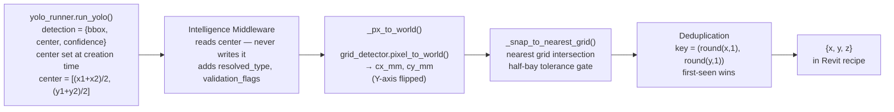
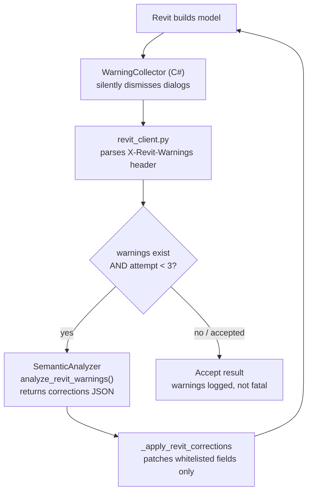

# MCC Amplify v5 — Floor Plan to BIM

AI-powered system that converts PDF floor plans into native Revit (`.RVT`) BIM models and interactive 3D web previews (glTF/GLB).

---

## What the System Does

Upload a PDF architectural floor plan and receive a fully-formed, editable Revit file. No manual re-drawing, no IFC round-trips. The system:

1. Runs **7 ML detection agents** (column, structural framing, core wall, stairs, lift, wall, slab) **in parallel with an algorithmic `GridDetector`** — the latter derives the real-world coordinate scale directly from PDF vector text (grid labels + dimension annotations), not from a model. Scale text (e.g. "1:100") is intentionally ignored as unreliable.
2. Merges all agent outputs, snaps detections to the PDF vector geometry, and resolves pixel coordinates into real-world mm using the detected grid.
3. Runs an **intelligence middleware layer** — type resolution (circular/rectangular/L-shape via cv2 contour analysis), cross-element validation (IoU overlap, grid distance, isolation checks), and DfMA rule enforcement (SS CP 65). Suspicious elements are flagged for the Edit Panel; beams whose placement would trigger Revit join conflicts are excluded from the recipe.
4. Enriches the Revit recipe with intelligence metadata (resolved type, validation flags, DfMA compliance status) then deduplicates elements that snapped to the same grid intersection.
5. Sends the Revit recipe over the network to a Windows machine running Revit 2023, where a C# Add-in creates all structural elements natively via the Revit API and returns the resulting `.RVT` file. Revit warnings trigger an AI correction loop (max 3 rounds).
6. Simultaneously exports a lightweight `.glb` (glTF binary) for instant web-based 3D preview.

---

## Architecture

```
Ubuntu (Linux) Machine                      Windows Machine
+----------------------------------------+  +----------------------------------+
|  FastAPI Backend (port 8000)           |  |  Revit 2023                      |
|  +----------------------------------+  |  |  +----------------------------+  |
|  |  PDF Security (150 MP budget)    |  |  |  |  C# Add-in (RevitAddin)    |  |
|  |  Source: Vector + Raster (para.) |  |  |  |  TcpListener TCP :5000     |  |
|  |  GridDetector (algorithmic)      |  |  |  |  Receives JSON recipe      |  |
|  |   + 6 ML Detection Agents (YOLO) |  |  |  |  Builds columns/framing/   |  |
|  |   Col · Frame · Wall · Stairs ·  |  |  |  |  walls/slabs natively      |  |
|  |   Lift · Slab                    |  |  |  |                            |  |
|  |  Detection Merger (grid align)   |  |  |  |  WarningCollector          |  |
|  |  Intelligence (TypeResolver →    |--+--+->|  auto-resolves join errors |  |
|  |   CrossElemValidator → DfMA →    |  |  |  |  Returns .RVT binary       |  |
|  |   Admittance Agent)              |  |  |  +----------------------------+  |
|  |  Semantic AI (Ollama SEA-LION)   |  |  |                                  |
|  |  Geometry Generation             |  |  +----------------------------------+
|  |  BIM Enricher + Dedup            |  |
|  |  RVT Exporter (RevitClient)      |<-+--+
|  |  glTF Exporter                   |  |
|  +----------------------------------+  |
|  Chat Agent (Ollama qwen3-vl / gemma3) |
|  React + Three.js Frontend (5173)      |
+----------------------------------------+
```

Both machines must be on the same local network (or VPN). The Ubuntu machine is the primary — it hosts the web UI, runs all AI processing, and drives the Windows Revit machine.

---

## Pipeline Stages

```mermaid
flowchart TB
    PDF(["📄 PDF input"])
    PDF --> sec

    subgraph PIPE["🏗️ Pipeline"]
        direction TB

        subgraph SEC["Stage 1 — Security & Size Check"]
            sec["SecurePDFRenderer
            Validate magic bytes
            150 MP pixel budget · 300 DPI up to A0"]
        end

        subgraph SRC["Stage 2 — Source Data  (parallel I/O)"]
            direction LR
            VEC["VectorProcessor
            PDF paths + text spans"]
            RAS["StreamingProcessor
            300 DPI raster render"]
        end

        subgraph AGENTS["Stage 3 — Parallel Detection  ·  asyncio.gather"]
            direction TB
            GRID["🧮 <b>GridDetector</b>  (algorithmic — no ML)
            PyMuPDF text extraction · label ↔ position pairing
            structural grid → mm scale"]
            subgraph MLAGENTS["🧠 ML Detection Agents  (YOLO)"]
                direction LR
                COL["Column Agent
                column-detect.pt  ✅"]
                FRAME["Framing Agent
                structural-framing-detect.pt  ✅"]
                WALL["Wall Agent  🚧"]
                STAIR["Stairs Agent  🚧"]
                LIFT["Lift Agent  🚧"]
                SLAB["Slab Agent
                slab-detect.pt  ✅"]
            end
        end

        MERGE["Stage 4 — Detection Merger
        HybridFusionPipeline · grid pixel alignment
        {bbox, center, confidence} → pixel coords"]

        subgraph INTBOX["Stage 4c — Intelligence Middleware"]
            direction TB
            INT["TypeResolver
            cv2 contour → circular / rectangular / L-shape"]
            INT --> CEV["CrossElementValidator
            IoU overlap · grid distance · isolation"]
            CEV --> DFMA["DfMA Rules
            SS CP 65 bay spacing"]
            DFMA --> ADM["Admittance Agent
            score signals (dashline · legend tag ·
            grid align · proximity) → admit / fix / reject"]
        end

        subgraph SEMBOX["Stage 5 — Semantic AI  (Ollama)"]
            SEM["Column annotation · SemanticAnalyzer
            aisingapore/Gemma-SEA-LION-v4-4B-VL
            materials · dimensions · building type"]
        end

        GEO["Stage 6 — Geometry Generation
        _px_to_world · _snap_to_nearest_grid
        Beam Z = Level 0 (beam top and slab top both flush with Level 0)
        Admittance-rejected elements skipped; material tag → family name"]

        subgraph BTEBOX["Stage 6.5 — BIM Enrichment + Dedup"]
            BTE["BIMTranslatorEnricher
            Merge intelligence metadata into recipe
            Deduplicate columns at same grid point (0.1 mm)"]
        end

        subgraph SANBOX["Stage 6.7 — Pre-Export Sanitizer"]
            SAN["sanitize_recipe()
            Snap beam endpoints to column centres, then trim to column faces
            Reject floating / same-column / diagonal / post-trim &lt; 500 mm beams
            Clamp column size ≥ 200 mm (Revit extrusion floor)"]
        end

        subgraph EXPORTBOX["Stage 7 — Export  (RVT + glTF run in parallel)"]
            direction TB
            subgraph RVTBOX["Stage 7a — RVT Export  (Linux → Windows)"]
                direction TB
                EXP["RevitClient · HTTP POST → :5000
                LoadStructuralFramingFamily → CJY_RC Structural Framing
                GetOrDuplicateSizedType: per-size FamilySymbol
                ApplyRCFramingPlacementDefaults: 0 extensions + Z-justify Center
                (top-referenced RC family — Center lands curve at beam top)
                WarningCollector auto-resolves join errors"]
                EXP --> WRN{"Revit warnings?"}
                WRN -->|"yes · attempt ≤ 3"| FIX["SemanticAnalyzer
                analyze_revit_warnings()
                patch whitelisted fields"]
                FIX -->|resend recipe| EXP
            end
            subgraph GLTBOX["Stage 7b — glTF Export"]
                GLTF["GltfExporter
                Z-up → Y-up rotation
                Columns extrude to top_level elevation
                columns · framing · walls · slabs"]
            end
        end

        SEC --> SRC --> AGENTS --> MERGE --> INTBOX --> SEMBOX --> GEO --> BTEBOX --> SANBOX --> EXPORTBOX
    end

    WRN -->|"no / accepted"| RVT
    GLTF --> GLB

    subgraph OUT["📤 Generated Outputs  (outside the pipeline)"]
        direction LR
        RVT(["📦 <b>.rvt file</b>
        native Revit model
        data/models/rvt/{job}.rvt"])
        GLB(["🌐 <b>.glb file</b>
        web 3D preview
        data/models/gltf/{job}.glb"])
    end

    classDef output fill:#d4edda,stroke:#28a745,stroke-width:3px,color:#155724
    class RVT,GLB output
    classDef algo fill:#fff3cd,stroke:#856404,stroke-width:2px,color:#856404
    class GRID algo
    classDef pipeline fill:#f8f9fa,stroke:#6c757d,stroke-width:2px
    class PIPE pipeline
```



### Stage Summary

| # | Stage | Component | Notes |
|---|-------|-----------|-------|
| 1 | Security & size check | `SecurePDFRenderer` | Validates magic bytes; 150 MP pixel budget allows 300 DPI up to A0/ANSI-E size |
| 2 | Source data (parallel I/O) | `VectorProcessor` + `StreamingProcessor` | PDF paths/text spans + 300 DPI raster render, run concurrently |
| 3 | Parallel detection | `GridDetector` (algorithmic) + ML agents: Column · Structural Framing · Stairs · Lift · Wall · Slab | All run concurrently via `asyncio.gather`. `GridDetector` uses PyMuPDF text extraction (no ML) and returns `grid_info` (mm scale + line positions). ML agents return `{bbox, center, confidence}` dicts from YOLO weights |
| 4 | Detection merger | `HybridFusionPipeline` / `GridDetector` | Fuses agent outputs, snaps to vector geometry, resolves pixel → mm coordinate space |
| 4c | Intelligence middleware | `resolve_types` / `validate_elements` / `enforce_rules` / `admittance.judge` | cv2 contour type classification; IoU/grid/isolation validation; DfMA bay-spacing rules (SS CP 65); **Admittance Agent** scores per-element signals (dashline → RC/steel, legend tag, grid alignment, column proximity) into admit / admit-with-fix (snap beam end to column face) / reject — see `intelligence/VALIDATION_AGENT.skill.md`. Writes decision overlay to `data/debug/{job}_join_conflicts.png` |
| 5 | Semantic AI | `SemanticAnalyzer` (Ollama) | `aisingapore/Gemma-SEA-LION-v4-4B-VL` — column annotation, materials, building type inference |
| 6 | Geometry generation | `GeometryGenerator` | `_px_to_world` → `_snap_to_nearest_grid` → Revit recipe; beam insertion Z = `Level0` so the beam top sits on the Level 0 line, flush with the slab top (slabs use `elevation=0` and Revit's `Floor.Create` extrudes the body downward, so the slab top is also at Level 0). Beam body hangs `depth_mm` below into the foundation zone; slab body hangs `slab_thickness` below. Skips admittance-rejected elements; reads `admittance_metadata.material` to emit `RCBeam…` / `SteelBeam…` family names |
| 6.5 | BIM enrichment + dedup | `BIMTranslatorEnricher` | Merges intelligence metadata; deduplicates elements at same grid intersection (rounds to 0.1 mm) |
| 6.7 | Pre-export sanitizer | `sanitize_recipe` | Snaps beam endpoints to nearest column centre, then trims each endpoint inward by the column's half-dimension so the beam body stops at the column face (no clash into column body); rejects floating / same-column / diagonal / post-trim sub-500 mm beams; clamps column size ≥ 200 mm (Revit extrusion floor) |
| 7a | RVT export | `RvtExporter` + Revit Add-in | Sends recipe to Windows Revit; `LoadStructuralFramingFamily` defaults beams to **CJY_RC Structural Framing** (800×800 mm) — steel is only used if admittance-tagged; per-size `FamilySymbol` duplication via `GetOrDuplicateSizedType`; `ApplyRCFramingPlacementDefaults` zeroes `START/END_EXTENSION` (so the body ends at the column face, not beyond it) and leaves `Z_JUSTIFICATION = Center`. The project's RC framing family has a top-referenced internal origin, so `Center` empirically lands the insertion curve at the **beam top** — the recipe passes `Level0` as the insertion Z, placing the beam top on the Level 0 line, flush with the slab top. If the family is ever swapped (e.g. to steel), re-verify this behavior. AI correction loop (max 3 rounds) on warnings; `WarningCollector` auto-resolves join errors |
| 7b | glTF export | `GltfExporter` | Writes `.glb` (Z-up → Y-up); columns extrude to their `top_level` elevation so beams sit flush; renders columns, framing, walls, slabs |

---

## Column Placement Pipeline (Protected Subsystem)

The exact flow below is frozen and must be preserved bit-for-bit:



No middleware, validator, or enricher may alter `cx_mm`, `cy_mm`, or `{x, y, z}` values after `_snap_to_nearest_grid()` runs. Deduplication removes entire column entries — it never modifies coordinate values within a surviving entry.

---

## Project Structure

```
mcc-amplify-v4/
|-- run.sh                              <- Start Ubuntu backend + frontend
|-- scripts/
|   |-- setup.sh / setup.bat            <- One-time venv + pip install for the backend (Linux / Windows)
|   |-- run.sh                          <- Canonical Ubuntu launcher (root run.sh just forwards here)
|   |-- run.bat                         <- Windows-side: launch Revit 2023 and wait for the add-in on :5000
|   |-- retrain_yolo.py                 <- YOLO fine-tuning flywheel driven by CorrectionsLogger output
|   └-- scan_family_library.py          <- Regenerate data/family_library/index.json
|
|-- backend/
|   |-- app.py                          <- FastAPI entry point
|   |-- .env                            <- Configuration (not committed)
|   |-- api/
|   |   |-- routes.py                   <- REST endpoints (upload, process, download)
|   |   └-- websocket.py               <- Real-time progress updates
|   |-- agents/
|   |   └-- revit_agent.py             <- Claude MCP agent for step-by-step Revit placement
|   |-- chat_agent/
|   |   |-- agent.py                   <- Chat agent (Ollama: qwen3-vl:2b / gemma3:4b-it-qat)
|   |   |-- context_manager.py         <- Per-user conversation context
|   |   |-- message_router.py          <- Routes messages to correct handler
|   |   └-- pipeline_observer.py       <- Bridges pipeline events to chat
|   |-- mcp/
|   |   |-- server.py                  <- MCP server for Revit agent
|   |   └-- tools.py                   <- MCP tool definitions
|   |-- services/
|   |   |-- core/orchestrator.py       <- Main pipeline orchestrator (all stages)
|   |   |-- pdf_processing/            <- VectorProcessor, StreamingProcessor
|   |   |-- security/                  <- SecurePDFRenderer, ResourceMonitor
|   |   |-- fusion/pipeline.py         <- HybridFusionPipeline (vector snapping)
|   |   |-- grid_detector.py           <- Structural grid detection, pixel->mm conversion
|   |   |-- yolo_runner.py             <- Tiling inference: CLAHE + 1280 px tiles / 200 px overlap + NMS
|   |   |-- column_annotator.py        <- 5-pass column annotation parser (schedule, proximity, vision LLM, single-scheme, 800 mm default)
|   |   |-- semantic_analyzer.py       <- Semantic AI (Ollama aisingapore/Gemma-SEA-LION-v4-4B-VL)
|   |   |-- geometry_generator.py      <- 2D -> Revit 3D parameter builder
|   |   |-- revit_client.py            <- HTTP client -> Windows Revit Add-in
|   |   |-- job_store.py               <- SQLite-backed persistent job status (LRU eviction)
|   |   |-- intelligence/              <- Post-detection middleware layer
|   |   |   |-- type_resolver.py       <- Circular/rectangular/L-shape classification
|   |   |   |-- cross_element_validator.py <- IoU, grid distance, isolation checks
|   |   |   |-- validation_agent.py    <- DfMA rule enforcement (SS CP 65) + join-conflict detection
|   |   |   |-- debug_overlay.py       <- PNG of beams rejected for join-conflict (data/debug/)
|   |   |   |-- recipe_sanitizer.py    <- Pre-export cleanup: snap/filter beams, clamp column min size
|   |   |   └-- bim_translator_enricher.py <- Append metadata to Revit recipe
|   |   |-- exporters/
|   |   |   |-- rvt_exporter.py        <- Sends to Windows, receives .RVT
|   |   |   └-- gltf_exporter.py       <- Writes .glb (Z-up to Y-up rotation)
|   |   |-- corrections_logger.py      <- Logs human corrections for YOLO retraining
|   |   └-- vision_comparator.py       <- Vision-based diff for Revit feedback
|   |-- ml/weights/                     <- (user-supplied) place column-detect.pt, structural-framing-detect.pt and slab-detect.pt here; see Troubleshooting
|   └-- utils/
|       |-- api_keys.py                <- Key resolution (env var -> .txt file)
|       |-- file_handler.py            <- Upload file handling
|       └-- logger.py                  <- Loguru setup
|
|-- revit_server/                      <- Windows-side Revit integration (C#)
|   |-- RevitAddin/                    <- C# Revit 2023 Add-in (build on Windows)
|   |   |-- App.cs                     <- TcpListener :5000 + ExternalEvent handler
|   |   |-- RevitModelBuilder.addin    <- Revit add-in manifest
|   |   |-- RevitModelBuilder.csproj
|   |   └-- build_and_deploy.bat       <- Build + copy add-in into %APPDATA%\Autodesk\Revit\Addins
|   |-- RevitMacro/                    <- Alternative macro-based runner (legacy)
|   |-- RevitService/                  <- Standalone Windows service variant
|   |-- csharp_service/                <- C# service shim
|   └-- python_service/                <- Python bridge helper
|
|-- frontend/                          <- React + Three.js web UI
|   └-- src/
|       └-- components/
|           |-- Layout.jsx             <- Root layout; wires upload/viewer/chat/edit + human-in-the-loop state
|           |-- UploadPanel.jsx        <- PDF upload + processing trigger (includes real-time progress bar)
|           |-- Viewer.jsx             <- 3D glTF viewer (Three.js)
|           |-- ChatPanel.jsx          <- AI chat assistant
|           └-- EditPanel.jsx          <- Element editing panel
|
|-- data/                              <- Runtime data (created automatically)
|   |-- uploads/
|   |-- models/
|   |   |-- rvt/                       <- Returned .RVT files
|   |   └-- gltf/                      <- Exported .glb files
|   |-- family_library/                <- Revit family sidecar JSON files
|   |   └-- index.json                 <- Generated by scripts/scan_family_library.py
    └-- revit_families.json            <- Family type definitions
```

---

## Configuration

Key settings in `backend/.env`:

```bash
# -- Chat Agent (local Ollama, no API keys) ------------------------------------
#   qwen3_vl  -> qwen3-vl:2b       (default)
#   gemma3_it -> gemma3:4b-it-qat  (alternative)
CHAT_MODEL_BACKEND=qwen3_vl

# -- Semantic AI Backend (pipeline Stage 5, local Ollama) ----------------------
SEMANTIC_BACKEND_PRIORITY=ollama
SEMANTIC_MODEL_BACKEND=ollama
OLLAMA_URL=http://localhost:11434
OLLAMA_MODEL=aisingapore/Gemma-SEA-LION-v4-4B-VL:latest

# -- Windows Revit Server ------------------------------------------------------
WINDOWS_REVIT_SERVER=http://LT-HQ-277:5000
REVIT_SERVER_API_KEY=choose_a_shared_secret

# -- Intelligence Middleware ---------------------------------------------------
COLUMN_CONF_THRESHOLD=0.25      # YOLO confidence for column detection
MAX_GRID_DIST_PX=80             # Max px distance from grid before "off_grid" flag
ISOLATION_RADIUS_PX=200         # Neighbourhood consensus radius
MIN_BAY_MM=3000                 # DfMA minimum bay spacing (SS CP 65)
MAX_BAY_MM=12000                # DfMA maximum bay spacing (SS CP 65)

# -- Beam geometry default -----------------------------------------------------
DEFAULT_BEAM_DEPTH_MM=800       # Beam cross-section depth (matches column default)

# -- FastAPI -------------------------------------------------------------------
APP_HOST=0.0.0.0
APP_PORT=8000

# -- Upload Limits -------------------------------------------------------------
MAX_UPLOAD_SIZE=52428800   # 50 MB
ALLOWED_EXTENSIONS=pdf
```

### Structural defaults (geometry_generator)

| Parameter | Default | Unit |
|-----------|---------|------|
| Wall height | 2800 | mm |
| Wall thickness | 200 | mm |
| Slab thickness | 200 | mm |
| Column default size | 800 | mm |
| Beam depth (`DEFAULT_BEAM_DEPTH_MM`) | 800 | mm |

---

## Quick Start

### Step 1 -- Prepare Windows (run once per session)

On the **Windows machine**, open PowerShell as Administrator and run:

```powershell
cd C:\path\to\mcc-amplify-v4\revit_server\RevitAddin
dotnet clean && dotnet build
Copy-Item RevitModelBuilder.addin, bin\Debug\net48\RevitModelBuilderAddin.dll `
    -Destination "C:\ProgramData\Autodesk\Revit\Addins\2023\"
Start-Process "C:\Program Files\Autodesk\Revit 2023\Revit.exe"
```

**When Revit opens:**
- Click **"Always Load"** on the security dialog to allow the Add-in.
- Open or create a project file -- the Add-in requires an active document.

Once Revit has fully loaded, verify the service is reachable from Ubuntu:

```bash
curl http://LT-HQ-277:5000/health
# Expected: Revit Model Builder ready
```

### Step 2 -- Configure network on Ubuntu (first-time only)

```bash
echo "191.168.124.64 LT-HQ-277" | sudo tee -a /etc/hosts
# Replace with your actual Windows IP (ipconfig on Windows) and hostname
```

### Step 3 -- Start the Ubuntu system

```bash
# From the project root
./run.sh
```

This starts:
- **Backend** at `http://localhost:8000`
- **Frontend** at `http://localhost:5173`

The script waits for the backend to be ready before starting the frontend. Press `Ctrl+C` to stop both.

### Step 4 -- Upload and process

1. Open `http://localhost:5173` in a browser.
2. Upload a **PDF** floor plan (max 50 MB).
3. Watch the real-time progress bar advance through all pipeline stages.
4. When processing completes:
   - Download the native **`.RVT`** file and open it in Revit -- all columns, structural framing, walls, and slabs will be editable native elements.
   - View the **3D web preview** (glTF) directly in the browser.

---

## System Requirements

### Ubuntu Machine
- Ubuntu 20.04 LTS or newer
- Python 3.10+
- Node.js 18+
- 16 GB RAM minimum (32 GB recommended for large PDFs)
- `tesseract-ocr`, `poppler-utils` installed

### Windows Machine
- Windows 10/11 Pro or Windows Server 2019+
- Revit 2023 (with valid license)
- .NET SDK 8.0 (for building) + .NET Framework 4.8 (for running)

---

## Closed-Loop Revit Feedback System



Key behaviours:
- **No popup dialogs** -- `IFailuresPreprocessor.PreprocessFailures()` calls `fa.DeleteWarning(msg)` on every warning, so Revit never shows the dialog.
- **Fatal errors** still cause transaction rollback and return a 500 from the C# server.
- **Max 3 export attempts** -- the loop is `for _attempt in range(3)` (attempts 0, 1, 2). After the 3rd build, whatever Revit produced is accepted as-is and any remaining warnings are surfaced on the `rvt_status` field.
- **Safety guardrails** -- `_apply_revit_corrections()` only patches whitelisted numeric fields (width, depth, height, thickness, etc.) so the AI cannot corrupt structural keys like level or id.

---

## Troubleshooting

**`curl http://LT-HQ-277:5000/health` times out**
- Verify the Windows IP in `/etc/hosts` is correct.
- Check that Windows Firewall allows inbound TCP on port 5000:
  ```powershell
  netsh advfirewall firewall add rule name="RevitAddin5000" dir=in action=allow protocol=TCP localport=5000 profile=any
  ```
- Ensure Revit is not in a modal state (Options dialog, Print dialog) -- these block the Revit API.

**Grid detection falls back to uniform grid**
- The system derives scale from structural column grid lines and dimension annotations in the PDF vector layer.
- If no grid is detected, a uniform 5x4 grid at 6000 mm bays is used as a fallback.
- Check the backend log: grid source and line count are logged at Stage 4.

**YOLO weights not found**
- Place the trained weights at `backend/ml/weights/column-detect.pt`, `backend/ml/weights/structural-framing-detect.pt`, and `backend/ml/weights/slab-detect.pt`.
- The pipeline continues if either is missing — affected agents return empty detections and only vector geometry is used downstream for that element type.

**Backend won't start**
```bash
which python && python -c "import fastapi, loguru; print('OK')"
tail -50 logs/app.log
```

**RVT file empty / Revit error**
- Check `C:\RevitOutput\addin_startup.log` and `C:\RevitOutput\build_log.txt` on Windows.
- Confirm the Add-in loaded: check the Add-ins tab in the Revit ribbon.
- Run Revit as Administrator if permission errors appear.

---

## Performance Expectations

| Metric | Value |
|--------|-------|
| Processing time | 30-90 s per floor plan |
| Column detection accuracy | 75-90 % |
| Structural framing (beam) detection | 75-90 % |
| Wall / stair / lift / slab | stub agents — untrained |
| Max file size | 50 MB |

---

## Support

- GitHub Issues: <https://github.com/josephteh97/mcc-amplify-ai/issues>
- API docs (when backend is running): <http://localhost:8000/api/docs>
